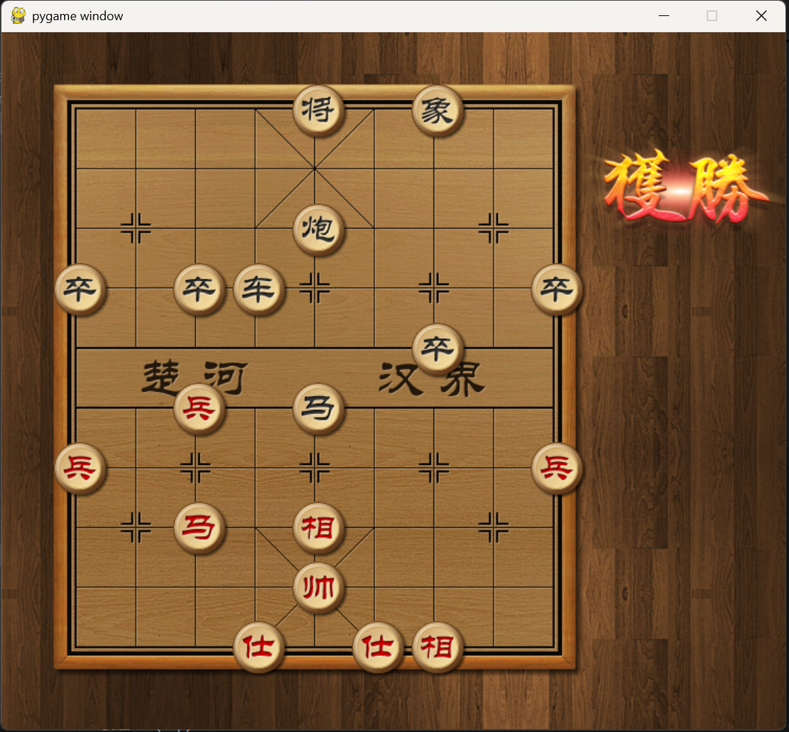
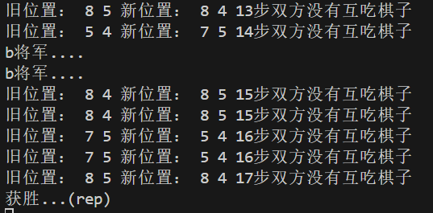
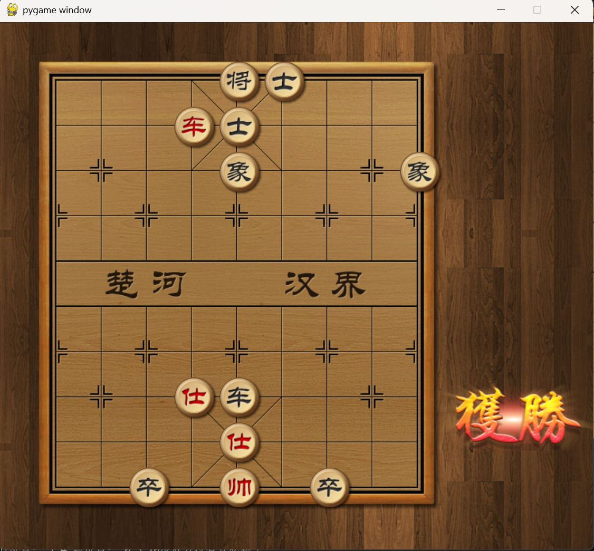
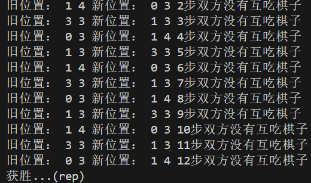

# Chinese-chess-ai

### 项目简介

实现一个中国象棋对抗ai

用博弈树进行零和博弈，设计一个评估函数评估当前局面（对于我方评估函数越高越好，对于对方评估函数越低越好），因为如果搜到结尾需要非常多层，当为4层时就i基本上有$55^4 - 1 \approx 9150624$，因此基本上不可能搜到层底的，所以需要深度限制。

如果单纯去搜索就太暴力了，因此可以用alpha-beta剪枝：alpha表示当前节点到其祖先节点搜索max节点的最好结果，beta表示min的最好结果，假设当前节点时max节点，搜索其中一个方案得到的now>beta，则对于max的祖先min，因为这个max节点后面得到的方案只会比now值大，而祖先min已经有了比now小的beta方案，那么min就不可能选择max节点，因此max节点就是一个废案，后面的节点都不需要再搜索了

### 环境准备

需要python3.7的环境，之后安装相关依赖

```bash
pip install pygame
pip install numpy
pip install pyarmor
```

之后 `python main.py`即可开始，其中我方ai默认为后手

注：可在 `main.py`中进行调整，`MyAI`为我设计的ai， `ChessAI`为对手ai这是一个加密过的文件看不到源码

### 关键代码及改进

我感觉最~麻烦~搞了最久的地方实际上是回溯还原棋盘原来的样子，因为我一开始想复用 `ChessBoard()`类的一些成员函数，比如 `move_chess()`，但事实上 `move_chess()`有一些不需要的地方比如 `ClickBox()`这个模块，因为有用户模块因此 `move_chess()`实际上是根据点击位置移动的，这个函数非常的耗时间，后面自己写一个函数 `self_movechess()`就会快很多

大概代码如下：

```python
def alpha_beta(self,chessboard,gameplayer,alpha,beta,back_button,depth):#return present_goat,0表示alpha(max,myself),1表示beta
    if 赢了/重复走棋(其实这个没什么用因为我都不超过四层)/深度达到/和棋:return self.evaluate_class.evaluate(chessboard) 

    for chess in chessboard.get_chess():#除去不是本方
        if chess.team!=self.now_player(gameplayer):continue
        for put_down_chess in chessboard.get_put_down_position(chess):
            移动棋子

            now_goat=self.alpha_beta(chessboard,1-gameplayer,alpha,beta,back_button,depth-1)

            还原棋子

            if gameplayer==0:
                alpha=max(alpha,now_goat)
                if alpha>=beta:break
            else:
                beta=min(beta,now_goat)
                if beta<=alpha:break
  
        if alpha>=beta:break

    if gameplayer==0:return alpha
    else: return beta  
```

然后就是在 `main.py`中修改走棋逻辑，导入我方ai，但是要把

```python
for event in pygame.event.get():
    if event.type == pygame.QUIT:
        pygame.quit()
        sys.exit()  # 退出程序
    else:
        break

```

保存下来，不然鼠标点一下就未响应了，走棋的时候尽量还是不要乱点，pygame比较脆弱（

以及必须要在python3.7下运行

### 实验结果

一个非常**神奇**的现象：一开始我调高了一层，会比较慢平均三十多秒内走一步棋，但是当我方后走时反而会被对方炮中炮将死，我方先走会出现走几步棋就出现重复走棋的现象（此时甚至没有将过军），**猜测**是因为评估函数适合于短期判断，而不适合深度探测

最后搜索层数在三层，基本上五秒内走一步棋

**我方后手**（黑方）





我方炮将军，但发生了马和帅长捉的局面，代码判断重复走棋三次，红方输

**我方先手**





这个也是重复走棋（ai走棋到最后基本上都是重复走棋僵持局面，可能调参数会好一点？）

有个同样神奇的特点是，我方先手时因为炮比马的权重大，我方会用炮直接打马，对方出车吃掉我的炮

但是如果我把炮的权重调高一点又会忽视马的作用而被对方的马将死
